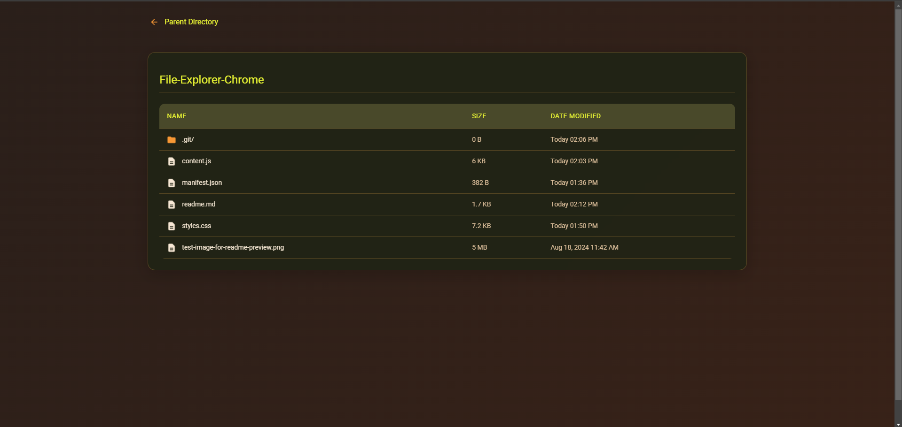
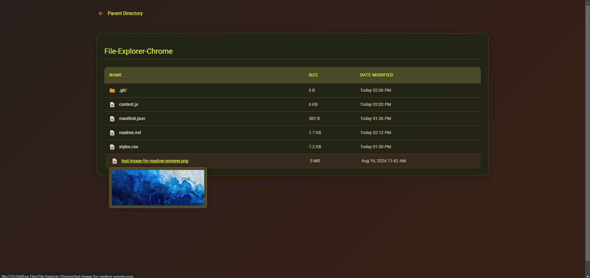

# File Explorer with Previews - Chrome Extension

This Chrome extension enhances the default file explorer experience by adding file previews for images and videos when hovering over file links. The extension allows you to see thumbnails for image files and video previews directly within the file explorer.

> [!Warning]
> This was roughly drafted with some input from claude.ai for my personal purposes and is guaranteed to work _if you are using my machine 😂_ It is surely buggy, and might give raise to unexpected behavior. Use it at your own risk. 

## Features

- **File Previews**: Displays previews for image and video files when hovered over
- **Image preview**: Thumbnail image appears for supported image files
- **Video preview**: Video player with controls appears for supported video files
- **File Information**: Displays file size and last modified date in a user-friendly format

## Screenshots

## Manual Installation

1. Download or clone this repository
2. Open Chrome and navigate to `chrome://extensions/`
3. Enable "Developer mode" by toggling the switch in the top right corner
4. Click "Load unpacked" button
5. Select the directory containing the extension files
6. The extension should now be installed and active

## Usage

1. Navigate to any local folder page in Chrome
2. Hover over any supported file link
3. A preview window will appear showing the file content
4. For videos, use the player controls to play/pause and adjust volume

## Privacy & Permissions

This extension requires the following permissions:
- Access to file URLs

No data is collected or transmitted to external servers.
